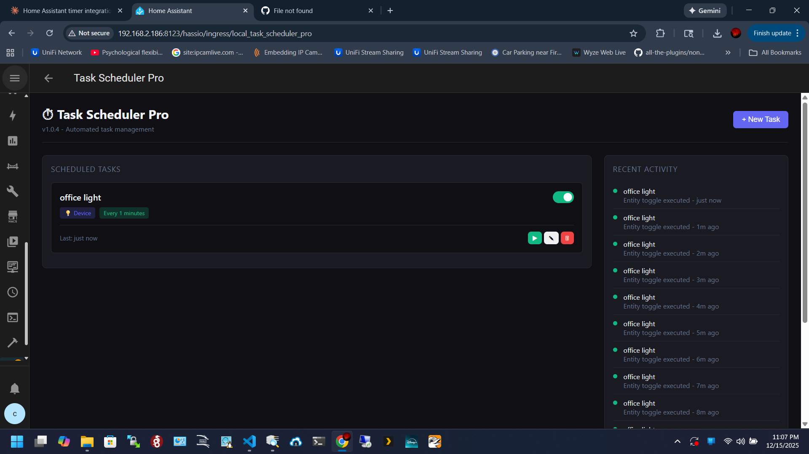

# Task Scheduler Pro for Home Assistant


A powerful and easy-to-use task scheduling add-on for Home Assistant with a beautiful dark-themed control panel. Schedule reboots, control lights with colors, trigger automations at sunrise/sunset, send notifications, and more!



## Features

- 🔄 **System Control** - Schedule host reboots and Home Assistant restarts
- 📦 **Add-on Management** - Restart any add-on on a schedule
- 💡 **Device Control** - Turn lights, switches, fans, and other devices on/off/toggle
- 🎨 **Advanced Light Control** - Set brightness, RGB colors, color temperature, and transition times
- 🌅 **Sunrise/Sunset Triggers** - Schedule tasks relative to dawn and dusk with offset support
- 🔔 **Notifications** - Send notifications to your phone or other devices
- 🤖 **Automation Triggers** - Trigger any automation on a schedule
- 📜 **Script Execution** - Run scripts at scheduled times
- ⚡ **Service Calls** - Call any Home Assistant service with custom data
- ⏰ **Flexible Scheduling** - Interval-based, cron-style, sunrise/sunset, or one-time
- 🎨 **Beautiful UI** - Modern dark-themed interface that matches Home Assistant
- 📊 **Execution History** - Track when tasks run and their success/failure status

## Installation

### Method 1: Add Repository (Recommended)

1. Open Home Assistant
2. Go to **Settings** → **Add-ons** → **Add-on Store**
3. Click the **⋮** menu (top right) → **Repositories**
4. Add this repository URL:
   ```
   https://github.com/nhscan/ha-task-scheduler
   ```
5. Click **Add** → **Close**
6. Find "Task Scheduler Pro" in the add-on store and click it
7. Click **Install**
8. After installation, click **Start**
9. Click **Open Web UI** to access the scheduler

### Method 2: Manual Installation

1. Download the latest release from the [Releases](https://github.com/nhscan/ha-task-scheduler/releases) page
2. Extract the `ha-task-scheduler` folder
3. Copy it to your Home Assistant's `/addons` directory:
   - **Via Samba share**: `\\homeassistant.local\addons\`
   - **Via SSH**: `/addons/`
   - **Via VS Code add-on**: Navigate to `/addons/`
4. Go to **Settings** → **Add-ons** → **Add-on Store**
5. Click the **⋮** menu → **Check for updates**
6. Find "Task Scheduler Pro" under **Local add-ons**
7. Click **Install**, then **Start**

## Usage

### Creating a Task

1. Click the **+ New Task** button
2. Enter a **Task Name** (e.g., "Nightly Reboot")
3. Select an **Action Type**:
   - 🔄 **Reboot Host** - Reboot the entire system
   - 🏠 **Restart Home Assistant** - Restart HA core only
   - 📦 **Restart Add-on** - Restart a specific add-on
   - 💡 **Control Device** - Turn on/off/toggle a device
   - ⚡ **Call Service** - Call any HA service
   - 🤖 **Trigger Automation** - Trigger an automation
   - 📜 **Run Script** - Execute a script
4. Configure action-specific options (select device, add-on, etc.)
5. Set the **Schedule**:
   - **Interval**: Every X minutes/hours/days
   - **Cron**: At specific times (hour, minute, days of week)
6. Click **Save**

### Managing Tasks

- **Toggle On/Off**: Use the switch to enable/disable a task
- **Run Now**: Click ▶️ to execute immediately
- **Edit**: Click ✎ to modify the task
- **Delete**: Click 🗑 to remove the task

### Example Use Cases

| Task | Action | Schedule |
|------|--------|----------|
| Weekly reboot | Reboot Host | Every Sunday at 3:00 AM |
| Restart flaky add-on | Restart Add-on | Every 6 hours |
| Morning lights | Control Device (turn_on) | Daily at 7:00 AM |
| Night mode | Trigger Automation | Daily at 10:00 PM |
| Clear cache | Call Service | Every 24 hours |

## Configuration

The add-on has minimal configuration options:

| Option | Description | Default |
|--------|-------------|---------|
| `log_level` | Logging verbosity (debug, info, warning, error) | `info` |

## API Endpoints

The add-on exposes a REST API for advanced users:

| Endpoint | Method | Description |
|----------|--------|-------------|
| `/api/tasks` | GET | List all tasks |
| `/api/tasks` | POST | Create a new task |
| `/api/tasks/{id}` | PUT | Update a task |
| `/api/tasks/{id}` | DELETE | Delete a task |
| `/api/tasks/{id}/toggle` | POST | Toggle task enabled state |
| `/api/tasks/{id}/run` | POST | Execute task immediately |
| `/api/addons` | GET | List installed add-ons |
| `/api/automations` | GET | List automations |
| `/api/scripts` | GET | List scripts |
| `/api/entities` | GET | List controllable entities |
| `/api/history` | GET | Get execution history |

## Troubleshooting

### Add-on won't start
- Check the add-on logs for error messages
- Ensure you have the latest version of Home Assistant

### Tasks not executing
- Verify the task is enabled (toggle switch is on)
- Check the execution history for error messages
- Ensure the target (add-on, device, etc.) exists

### Devices not showing in dropdown
- Only lights, switches, fans, covers, climate devices, input_booleans, and media players are shown
- Refresh the page if you recently added new devices

### "Error loading" in dropdowns
- Restart the add-on
- Clear browser cache and hard refresh (Ctrl+Shift+R)

## Technical Details

- **Backend**: Python with aiohttp and APScheduler
- **Frontend**: Vanilla JavaScript with modern CSS
- **Storage**: JSON file in `/config/task_scheduler/`
- **Port**: 8099 (configurable via ingress)

## Contributing

Contributions are welcome! Please feel free to submit a Pull Request.

1. Fork the repository
2. Create your feature branch (`git checkout -b feature/AmazingFeature`)
3. Commit your changes (`git commit -m 'Add some AmazingFeature'`)
4. Push to the branch (`git push origin feature/AmazingFeature`)
5. Open a Pull Request

## License

This project is licensed under the MIT License - see the [LICENSE](LICENSE) file for details.

## Support

- 🐛 [Report a bug](https://github.com/nhscan/ha-task-scheduler/issues)
- 💡 [Request a feature](https://github.com/nhscan/ha-task-scheduler/issues)
- ⭐ Star this repo if you find it useful!

## Changelog

See [CHANGELOG.md](CHANGELOG.md) for a list of changes.

---

Made with ❤️ for the Home Assistant community
